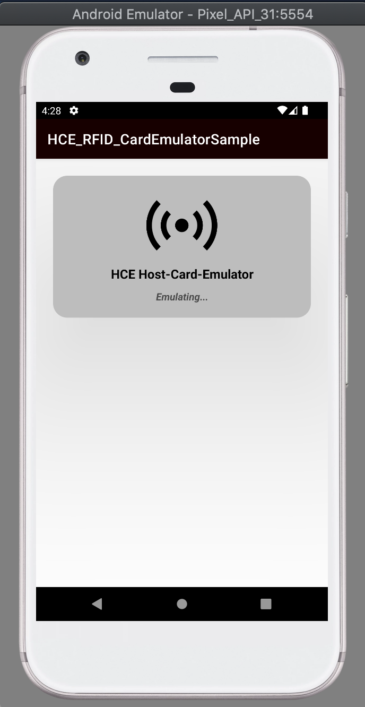

# HCE RFID/NFC Emulate APP
## Android HCE (host-based Card Emulation) app sample of how to "emulate" an NFC/RFID tag/card

* Kotlin
* NFC
* RFID
* HCE

## How to test?
* Open the app
* Approach your device behind of some RFID reader
* The RFID reader (i.e: https://github.com/layonmartins/NFCReaderSample) can read your device as a RFID/NFC tag

